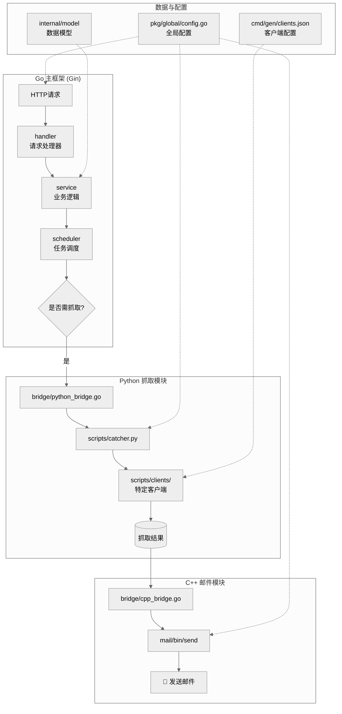

# 😼 NotiCat Server

<div align="center">


[NotiCat Android 客户端](https://github.com/SpeechlessMatt/NotiCat-Android) · [问题反馈](https://github.com/SpeechlessMatt/NotiCat-Server/issues)

</div>

## 🌟 项目简介

NotiCat Server 是一个高效的网页内容监控与通知聚合系统。它为没有主动通知功能的网站添加监控能力，通过智能去重和规则筛选，将用户感兴趣的内容通过邮件（或其他可替换的通道）实时推送给用户。

## ✨ 核心特性

- **多语言混合架构**：Go 作为主框架，C++ 处理邮件发送，Python 负责网页抓取
- **智能请求去重**：通过数据库聚合用户订阅，对同一资源只抓取一次，分发多个用户
- **高度解耦设计**：邮件模块和抓取模块均可独立替换
- **灵活规则筛选**：支持正则表达式和关键字过滤，精准匹配用户需求
- **便捷客户端扩展**：添加新网站支持仅需简单配置和 Python 脚本

## 🏗️ 系统架构



---

## 📦 快速开始

### 环境要求

> **注意**：请确保已安装以下依赖（版本要求可能随项目更新变化）

- **Go** 1.24+ (主框架)
- **Python** 3.13+ (网页抓取)
- **C++17** 兼容编译器 (邮件发送)
- **Redis** (任务队列与缓存)
- **Make** (构建工具)

### 构建与安装

```bash
# 克隆项目
git clone https://github.com/SpeechlessMatt/NotiCat-Server.git
cd NotiCat-Server

# 完整构建（编译所有模块）
make all

# 配置与代码生成（更新客户端支持）
make gen
```

## 🔧 配置说明

### 客户端配置文件 (clients.json)

位于 cmd/gen/clients.json，定义了所有支持的网站客户端：

```json
{
  "name": "NotiCat Server (Main)",
  "version": "0.1.2",
  "owner": "edbinmatt",
  "description": "Notification bridge server",
  "support_clients": [
    {
      "client": "bili",
      "name": "BiliClient",
      "url": "https://www.bilibili.com",
      "description": "B站UP主动态订阅",
      "credentials": [],
      "extra": [
        {
          "label": "URL",
          "api_key": "url"
        }
      ]
    }
  ]
}
```

**字段说明**：

- **client**: 客户端标识符（对应 Python 脚本）

- **name**: 显示名称

- **url**: 目标网站URL

- **description**: 功能描述

- **credentials**: 所需认证字段（如用户名/密码：["username", "password"]）

- **extra**: 所需额外参数，传递给 Python 脚本

## 🚀 添加新客户端

扩展 NotiCat 以支持新网站非常简单，只需两步：

### 步骤1：修改配置文件

在 clients.json 的 support_clients 数组中添加新条目：

```json
{
  "client": "example",
  "name": "ExampleClient",
  "url": "https://example.com",
  "description": "示例网站监控",
  "credentials": ["username", "password"],
  "extra": [
    {
      "label": "喜好",
      "api_key": "like"
    },
    {
      "label": "页码",
      "api_key": "page"
    }
  ]
}
```

### 步骤2：创建 Python 客户端

在 scripts/clients/ 目录下创建新的 Python 文件：

```python
from .base import BaseClient

class ExampleClient(BaseClient):
    # client_id 会自动从类名生成（移除"Client"并转为小写）
    # 即：ExampleClient -> "example"
    # 也可以自己定义，如下(取消注释) -> "example_show"
    # client_id = "example_show"
    
    def __init__(self, username, password, extra) -> None:
        super().__init__(username=username, password=password, extra=extra)
    
    def fetch(self) -> list:
        """实现抓取逻辑，返回消息列表"""
        # 您的抓取代码
        messages = []
        # ... 抓取逻辑
        return messages
```

### 步骤3：应用更改

项目根目录运行

```bash
# 运行 make gen 更新配置
make gen
```

完成！ 新的客户端已集成到系统中。Go 框架会自动调用：

```bash
python scripts/catcher.py example 用户名 密码 --extra ...
```

---

## 📡 运行机制

### 任务调度流程

1. 订阅聚合：系统收集所有用户对同一资源的订阅

2. 智能抓取：对每个资源只执行一次抓取操作

3. 规则过滤：根据用户设置的正则/关键字规则筛选内容

4. 分发推送：将匹配的内容通过邮件（或其他通道）发送给相应用户

### 模块调用关系

```text
用户请求 → Go主框架 → 任务调度 → Python抓取 → C++邮件发送
                ↓
            数据库记录
                ↓
          用户规则匹配
```

---

## 🛠️ 开发与部署

### 开发环境

**开发依赖**：

- **Linux** 环境（推荐 Ubuntu 20.04+ 或其他主流 Linux 发行版）
- **Go** 1.24+ 
- **Python** 3.13+
- **Make** 构建工具
- **libcurl** 4.x+ （C++ 邮件模块依赖）
- **gcc/g++** 或 clang （C++ 编译器，需要 C++17 支持）

**本地开发流程**：

```bash
# 克隆并进入项目
git clone https://github.com/SpeechlessMatt/NotiCat-Server.git
cd NotiCat-Server

# 安装依赖（Ubuntu/Debian）
sudo apt-get install make gcc g++ libcurl4-openssl-dev

# 编译所有模块
make all

# 运行测试/开发
go run main.go
```

### 生产部署

环境变量配置：

```bash
# 务必记得修改Jwt密钥，否则服务器有安全风险
export NOTICAT_JWT_SECRET="你的密钥"
# SMTP 服务器地址，支持简称或完整 URL
export NOTICAT_SMTP_SERVER="163"
# 你的邮箱账号
export NOTICAT_EMAIL_ACCOUNT="boss@163.com"
# 你的邮箱 SMTP 授权码
export NOTICAT_EMAIL_AUTHCODE="你的授权码"
export GIN_MODE=release

go run main.go
```

**SMTP 服务器配置说明**：

可选的简称和对应的完整 URL：

| 简称 | 完整 URL |
|------|---------|
| `163` | `smtps://smtp.163.com:465` |
| `126` | `smtps://smtp.126.com:465` |
| `qq` | `smtps://smtp.qq.com:465` |
| `yeah` | `smtps://smtp.yeah.net:465` |
| `netease` | `smtps://smtp.netease.com:465` |
| `sina` | `smtps://smtp.sina.com:465` |
| `sinaVIP` | `smtps://smtp.vip.sina.com:465` |
| `aliyun` | `smtps://smtp.aliyun.com:465` |
| `sohu` | `smtps://smtp.sohu.com:465` |
| `gmail` | `smtps://smtp.gmail.com:465` |
| `outlook` | `smtps://smtp-mail.outlook.com:587` |
| `hotmail` | `smtps://smtp-mail.outlook.com:587` |
| `yahoo` | `smtps://smtp.mail.yahoo.com:465` |
| `icloud` | `smtps://smtp.mail.me.com:587` |
| `qq_enterprise` | `smtps://smtp.exmail.qq.com:465` |
| `netease_enterprise` | `smtps://smtp.qiye.163.com:465` |
| `ali_enterprise` | `smtps://smtp.mxhichina.com:465` |
| `tencent_enterprise_legacy` | `smtps://smtp.exmail.qq.com:465` |

使用简称示例：`export NOTICAT_SMTP_SERVER="qq"` 或使用完整 URL：`export NOTICAT_SMTP_SERVER="smtps://smtp.qq.com:465"`

---

## 🐳 使用 Docker 部署（可选）

项目提供基于多阶段构建的 `Dockerfile` 和 `docker-compose.yml`，可以将整个服务（含 C++ 邮件模块与 Python 脚本）打包运行。

快速示例：

构建镜像：

```bash
# 在项目根目录构建镜像
docker build -t noticat-server:latest .
```

使用 docker-compose（包含 Redis）：

```bash
docker-compose up --build -d
```

常见调试：

- 查看日志：`docker-compose logs -f noticat`
- 进入容器：`docker-compose exec noticat /bin/bash`

说明：
- 镜像在构建阶段会编译 C++ 邮件二进制并构建 Go 可执行文件；如果你的环境需要特殊编译选项，请在 `Dockerfile` 中调整。
- `docker-compose.yml` 示例会把 `NOTICAT_SMTP_SERVER` 设置为简称（例如 `qq`），也可直接填入完整 SMTP URL。


## 🤝 贡献指南

我们欢迎各种形式的贡献！请参阅以下步骤：

1. Fork 本仓库

2. 创建功能分支 (git checkout -b feature/amazing-feature)

3. 提交更改 (git commit -m 'Add some amazing feature')

4. 推送分支 (git push origin feature/amazing-feature)

5. 开启 Pull Request

### 贡献类型

- 添加新的网站客户端
- 改进现有抓取逻辑
- 优化系统性能
- 修复 Bug
- 完善文档

## 📄 许可证

本项目源代码基于 [Apache License 2.0](https://www.apache.org/licenses/LICENSE-2.0) 开源协议发布，您可以自由地使用、修改和分发代码，包括用于商业目的。

## ⚠️ 免责声明

NotiCat-Server 是一个为个人学习和研究目的而设计的开源工具。

1.  **合法性**：您在使用本工具时，有责任确保您的行为符合：
    *   目标网站的 `robots.txt` 协议和服务条款。
    *   您所在国家/地区关于数据获取与使用的相关法律法规。
    *   本工具仅用于**合法、正当**的用途，严禁用于任何侵犯他人权益、破坏计算机系统或干扰正常网络服务的活动。

2.  **数据与稳定性**：
    *   我们无法保证通过本工具获取的数据的**准确性、及时性或完整性**，数据内容完全依赖于目标网站。
    *   由于目标网站的改版、反爬策略或网络问题，客户端的运行可能随时**中断或失效**。
    *   本项目提供的“客户端”仅作为技术示例，**不构成对任何第三方网站的官方支持或合作关系**。

3.  **使用风险**：
    *   使用本工具可能存在的**一切风险**（包括但不限于账号被封禁、IP被封锁、法律纠纷等）将由**使用者自行承担**。
    *   项目开发者及贡献者**不对因使用或无法使用本项目而导致的任何直接或间接损失承担责任**。

4.  **合理使用**：
    *   请在抓取时设置**合理的频率与间隔**，避免对目标网站服务器造成不必要的负荷。
    *   我们鼓励将本项目用于学习网络通信、解析技术及任务调度架构。

**简而言之：请合法、合规、友善地使用此工具，并对自己的行为负责。**

<div align="center"><sub>Built with ❤️ by Czy_4201b</sub></div>

